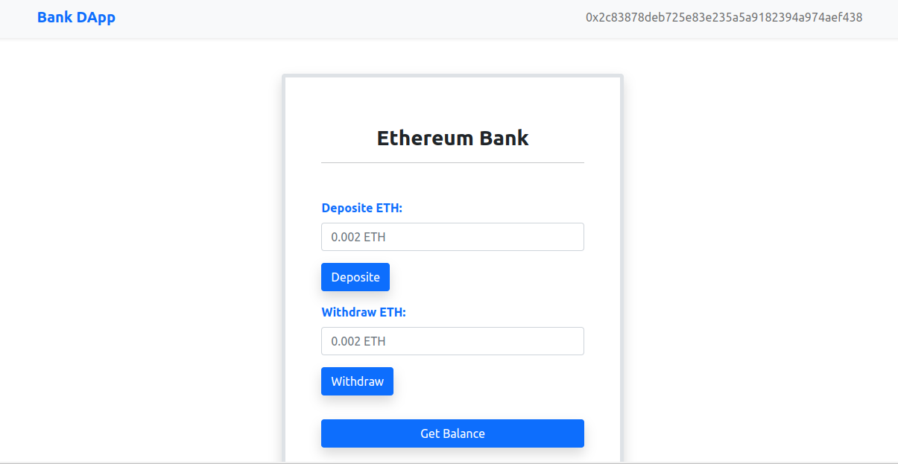

# Ethereum ĐApp
A decentralized banking website that user can deposite, withdraw and view balance using an Ethereum smart contract.



### Prerequisites

* [Node.js](https://nodejs.org/en/), a JavaScript runtime
* [npm](https://www.npmjs.com), a package manager for JavaScript


### Installing

#### Node.js and npm  
Go to https://nodejs.org/en/ to download the package or use Homebrew to install
```
brew install node
```
Check whether node and npm installed correctly using
```
node -v
npm -v
```

### node-modules
```
npm install
```


###### Note: npm installs to the current directory in the terminal

## Running the server

```
node server.js
```
Server listening on port : 3000


